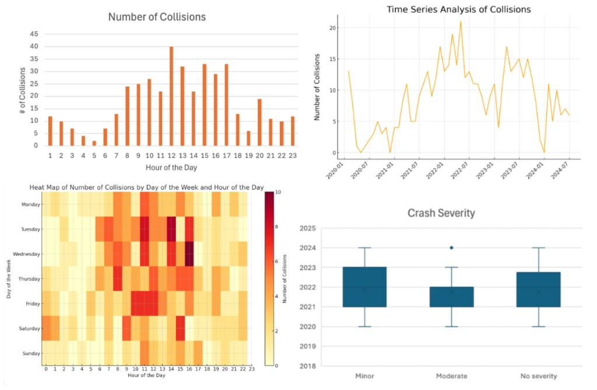
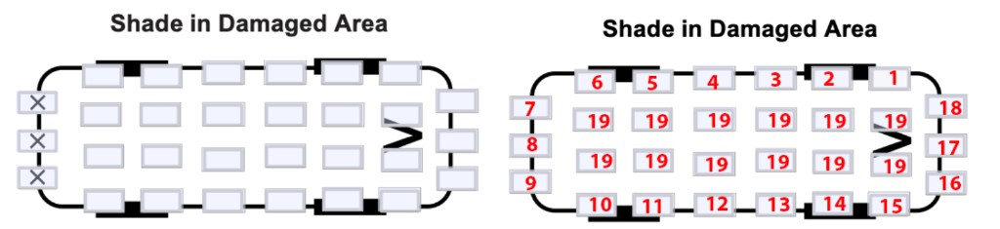
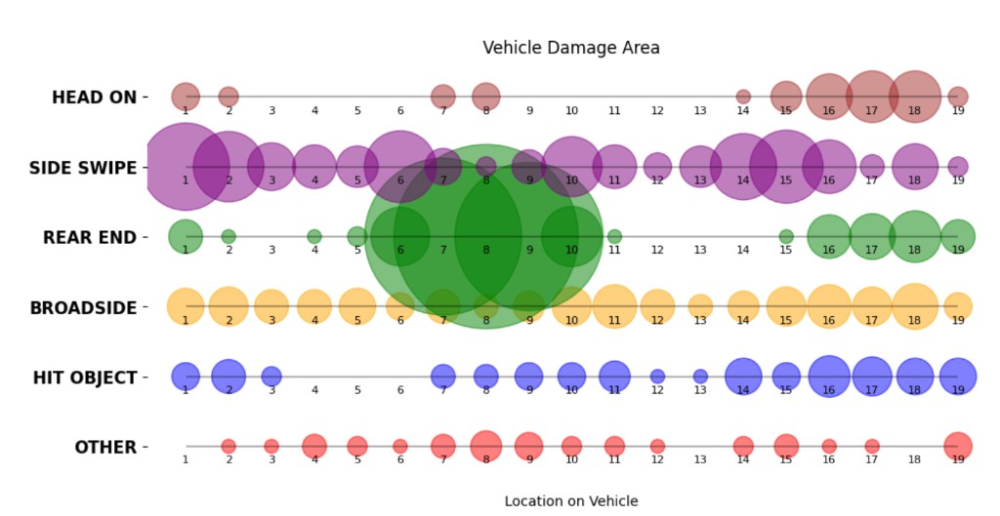

# Investigating Factors Contributing to Autonomous Vehicle Crash Severity

Machine-learning analysis of **California DMV autonomous-vehicle (AV) collision
reports** — identifying the factors that drive crash severity, and mapping where
different collision types damage the vehicle.

*Companion code and analysis to the TRB paper: L. Lim, J. Chen, M. Espinoza,
S. Moura, "Investigating Factors Contributing to Autonomous Vehicle Crash
Severity Using Machine Learning and Recursive Feature Elimination (RFE)"
(UC Berkeley).*

## Data source

All crash records come from **California DMV Autonomous Vehicle Collision
Reporting** — the collisions AV manufacturers are required to report to the CA
DMV (§227.48). The study uses **641 AV collisions from 2018–2024**.

- CA DMV AV collision reports: <https://www.dmv.ca.gov/portal/vehicle-industry-services/autonomous-vehicles/autonomous-vehicle-collision-reports/>
- Reporting explored/visualized via **UC Berkeley SafeTREC — Transportation
  Injury Mapping System (TIMS), AV Safety**:
  <https://tims.berkeley.edu/tools/avsafety.php>

## Interactive crash map

**[▶ Open the interactive AV crash map](https://lindalim478.github.io/CA_DMV_CollisionsPaper/AV_Crash_Map.html)**
— explore AV crash locations across California (hosted via GitHub Pages).

## Approach

Crash severity is classified into four levels — **NONE (0)**, **MINOR (1)**,
**MODERATE (2)**, **SEVERE (3)** — from injuries and vehicle damage. Six machine
-learning classifiers (Decision Tree, Logistic Regression, Random Forest, SVM,
Naïve Bayes, KNN) are compared, with:

- **Recursive Feature Elimination (RFE)** to rank the most influential features.
- **Multi-Distance Augmentation (MDA)** to counter class imbalance in the rarer
  Moderate/Severe classes.
- A custom **vehicle damage-area schematic** (below) turned into features, so the
  *location* of impact around the vehicle becomes a predictor.

**Headline result:** SVM and Logistic Regression are the strongest models,
reaching **~92%** and **~91%** accuracy respectively, validated by k-fold
cross-validation (Random Forest ~91%). The top severity predictors include
vehicle movement/status, **specific damage locations** (e.g., rear-end/back
corner), collision type, vehicle type, lighting, and location.

## Temporal patterns of AV collisions

<p align="center">
  
</p>

*AV collision patterns in the CA DMV dataset: (top-left) collisions by hour of
day — most cluster between **noon and 5 PM**; (top-right) collisions over
2020–2024; (bottom-left) a day-of-week × hour heat map concentrating on weekday
midday/afternoon; (bottom-right) crash-severity distribution over time.*

## Vehicle damage-area schematic

To capture *where* each crash impacts the vehicle, the DMV report's "Shade in
Damaged Area" markings are digitized into **19 numbered zones** around the
vehicle and added as features. Zones **7–9** correspond to the **rear
bumper / back-end corner**; the front is on the right (`>`).

<p align="center">
  
</p>

*Left: raw "Shade in Damaged Area" markings from the DMV report. Right: the
19-zone numbering system used to encode impact location as model features.*

## Where collisions hit the vehicle — and what it tells us

<p align="center">
  
</p>

*Damage location (zones 1–19) by collision type. Bubble size reflects how often
each zone is damaged for that collision type.*

**Reading the diagram — the big green rear-end bubbles are the story.** The most
striking pattern is the cluster of **large green bubbles for REAR-END collisions
concentrated in the rear zones (≈7–9)** of the vehicle:

- **AVs are disproportionately struck from behind.** The heavy rear-end
  concentration suggests that in a large share of AV collisions the AV was hit
  from the rear — meaning the **following (human-driven) vehicle is frequently at
  fault**, rather than the AV itself.
- **Likely mechanism.** Human drivers may mis-anticipate AV behavior — AVs tend
  to brake earlier or more conservatively, and differences in braking dynamics
  between AVs and human drivers can leave trailing drivers unable to react in
  time.
- **Other collision types spread out.** Side-swipe damage runs along both flanks,
  while broadside and hit-object impacts distribute more evenly around the body —
  the rear concentration is unique to rear-end events.
- **Consistent with the models.** Rear zones show up among the top severity
  predictors (e.g., `Damage_9` = back-end corner, `Damage_8` = rear-end bumper),
  reinforcing that impact location is genuinely informative, not incidental.

**Design & policy implications:** prioritize **rear sensor coverage and rear-
facing detection**, clearer **braking/intent signaling** (e.g., V2X), and caution
when reading raw AV crash counts as AV *culpability* — being rear-ended is often
outside the AV's control.

## Start here

The core analysis lives in **`CA_OLSDMV_Reporting.ipynb`** (severity
classification, RFE/MDA, model comparison, damage-area features). The other
notebooks are more exploratory.

## Repository contents

| File | Description |
| --- | --- |
| `CA_OLSDMV_Reporting.ipynb` | **Main analysis** — severity classification, RFE/MDA, model comparison, damage-area figures. |
| `Collisions Diagram.ipynb` | Collision diagrams / damage-area visualizations. |
| `Disengagements.ipynb` | Analysis of AV disengagement reports. |
| `CA_DMV_CollisionsDataset.csv` | CA DMV AV collision records enriched with location + census/demographic fields. |
| `AV_Crash_Map.html` | Source for the interactive crash map ([view live](https://lindalim478.github.io/CA_DMV_CollisionsPaper/AV_Crash_Map.html)). |
| `NHTSA EMS Crashes.xlsx` | Supplementary NHTSA EMS crash data. |
| `figures/` | Figures used in this README. |

## Getting started

```bash
python -m venv .venv
source .venv/bin/activate
pip install jupyter pandas numpy scikit-learn matplotlib seaborn folium openpyxl
jupyter lab
```

Open `CA_OLSDMV_Reporting.ipynb` and run the cells.

## Data notes

The collision dataset joins DMV-reported AV collisions with U.S. Census
tract/block-level demographics (median age, population, race/ethnicity,
median income) for spatial and equity-oriented analysis.
